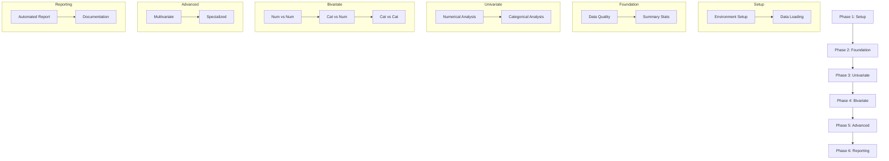

### **Phase 1: Setup & Data Preparation**
1. **Environment Setup**
   - Install required packages: `pandas`, `numpy`, `matplotlib`, `seaborn`, `plotly`, `scipy`, `pandas-profiling`
   - Create virtual environment and requirements.txt file

2. **Data Loading & Initial Inspection**
   - Load dataset from CSV/Excel/database
   - Create data dictionary with column descriptions
   - Deliverable: `data_overview.py` with:
     - Shape inspection
     - First/last 5 rows display
     - Column data types check

### **Phase 2: Foundational Analysis**
3. **Data Quality Assessment**
   - Implement missing value detection
   - Identify duplicate records
   - Deliverable: `data_quality_report.py` with:
     - Missing value heatmap
     - Duplicate count summary
     - Data type validation report

4. **Descriptive Statistics**
   - Calculate numerical summaries (mean, median, std, quartiles)
   - Generate categorical frequency tables
   - Deliverable: `summary_stats.py` with:
     - Numerical summary table
     - Categorical value counts
     - Skewness/kurtosis calculations

### **Phase 3: Univariate Exploration**
5. **Numerical Variable Analysis**
   - Create distribution visualizations
   - Implement outlier detection
   - Deliverable: `univariate_numerical.py` with:
     - Histograms with KDE
     - Box plots
     - Outlier summary tables (Z-score/IQR methods)

6. **Categorical Variable Analysis**
   - Visualize frequency distributions
   - Calculate proportions
   - Deliverable: `univariate_categorical.py` with:
     - Bar charts
     - Pie charts
     - Pareto charts for key categories

### **Phase 4: Relationship Analysis**
7. **Numerical vs Numerical**
   - Implement correlation analysis
   - Visualize relationships
   - Deliverable: `bivariate_numerical.py` with:
     - Scatter plots with trend lines
     - Correlation heatmaps
     - Pair plots for key variables

8. **Categorical vs Numerical**
   - Compare distributions across groups
   - Test for significant differences
   - Deliverable: `bivariate_mixed.py` with:
     - Grouped box/violin plots
     - Faceted histograms
     - Statistical test results (t-test/ANOVA)

9. **Categorical vs Categorical**
   - Analyze associations
   - Visualize proportional relationships
   - Deliverable: `bivariate_categorical.py` with:
     - Stacked/grouped bar charts
     - Mosaic plots
     - Chi-square test results

### **Phase 5: Advanced Analysis**
10. **Multivariate Exploration**
    - Implement complex visualizations
    - Deliverable: `multivariate_analysis.py` with:
      - 3D scatter plots
      - Faceted grids
      - Parallel coordinates plots

11. **Specialized Analysis**
    - Handle time-series data (if applicable)
    - Process geospatial data (if applicable)
    - Deliverable: `specialized_analysis.py` with:
      - Time-series decomposition plots
      - Geospatial visualizations
      - Seasonality analysis

### **Phase 6: Reporting & Insights**
12. **Automated Reporting**
    - Generate comprehensive EDA report
    - Deliverable: `eda_report.py` with:
      - Pandas-profiling report
      - Interactive Plotly dashboard
      - Key insights summary

13. **Documentation & Presentation**
    - Create annotated codebook
    - Prepare presentation slides
    - Deliverable: `eda_documentation/` with:
      - Code documentation
      - Visual summary of findings
      - Recommendations for next steps

### **Implementation Workflow**


### **Key Deliverables Structure**
```
eda_project/
├── data/
│   ├── raw_data.csv
│   └── processed_data.csv
├── notebooks/
│   ├── 01_data_preparation.ipynb
│   ├── 02_univariate_analysis.ipynb
│   ├── 03_bivariate_analysis.ipynb
│   └── 04_advanced_analysis.ipynb
├── scripts/
│   ├── data_overview.py
│   ├── summary_stats.py
│   ├── visualizations.py
│   └── report_generator.py
├── outputs/
│   ├── figures/
│   ├── reports/
│   └── documentation/
├── requirements.txt
└── README.md
```

### **Quality Control Tasks**
1. **Validation Checks**
   - Verify data integrity at each step
   - Test edge cases (empty values, extreme outliers)
   - Confirm statistical assumptions

2. **Visualization Review**
   - Ensure plots are labeled and interpretable
   - Validate color schemes for accessibility
   - Check interactive elements functionality

3. **Documentation Standards**
   - Maintain consistent code commenting
   - Create data dictionary
   - Version control for all outputs
